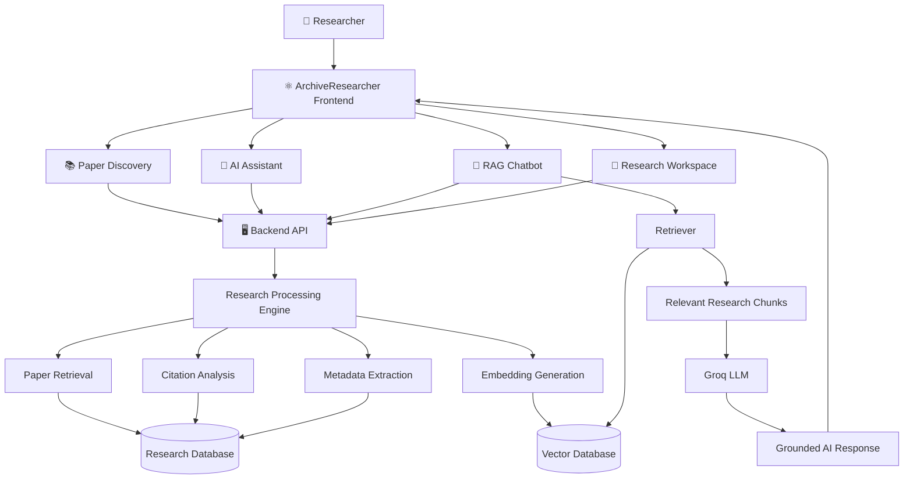
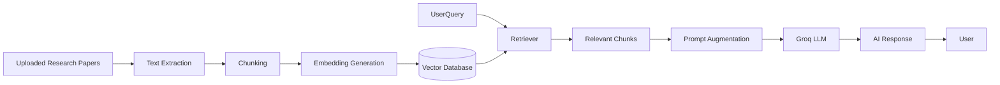
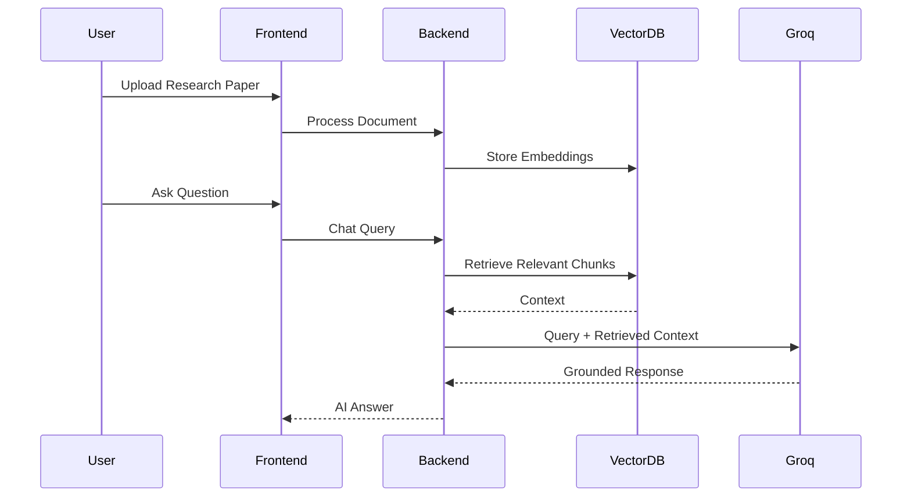
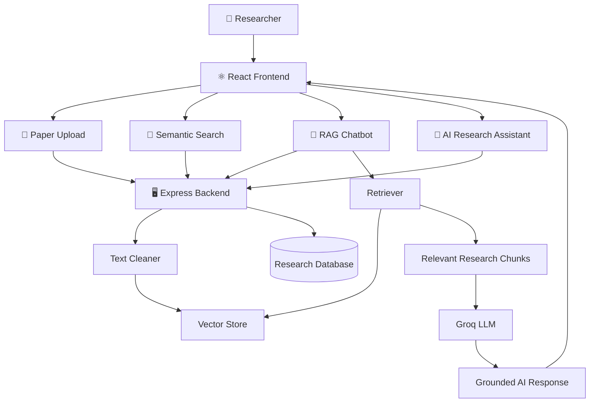
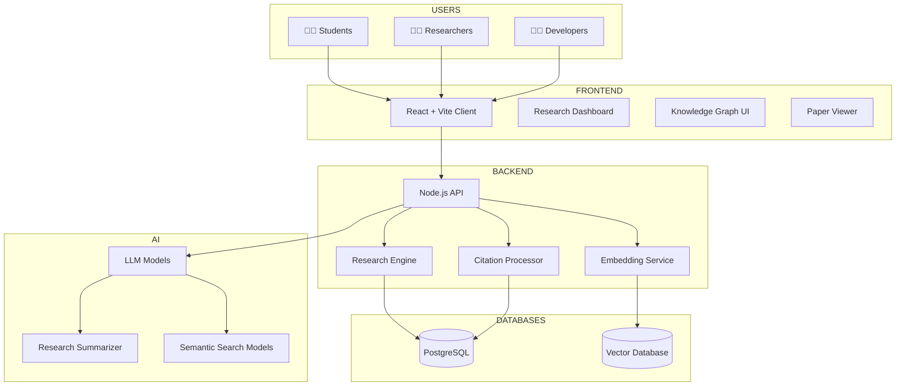
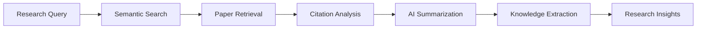

<div align="center">

# 📚 ArchiveResearcher

### AI-Powered Research Discovery & Knowledge Intelligence Platform


<br/>
<br/>


</div>

---

# ✨ Overview

**ArchiveResearcher** is an AI-powered Research Intelligence Platform designed to help students, researchers, developers, and academics discover, analyze, understand, and interact with research papers using advanced Artificial Intelligence.

The platform combines:

- 📚 Research paper discovery
- 🔎 Semantic search and retrieval
- 🧠 AI-powered research analysis
- 🤖 RAG-based AI Chatbot
- 📊 Citation intelligence
- 📂 Research workspace management
- ⚡ Interactive research workflows

Unlike traditional research tools, ArchiveResearcher enables users to upload papers and directly chat with an AI assistant that answers questions using the actual content of uploaded research documents.
The result is a powerful research environment where users can explore, analyze, and converse with knowledge.

---

# 🚀 Core Features

## 📖 Research Discovery
- Search academic papers
- Research topic exploration
- Intelligent source discovery
- Multi-domain research support

## 🤖 AI Research Assistant
- Research summarization
- Concept explanations
- Paper understanding
- Literature review assistance

## 💬 RAG-Based AI Chatbot
- Chat with uploaded papers
- Context-aware responses
- Multi-document understanding
- Retrieval-Augmented Generation (RAG)
- Research Q&A
- Grounded AI responses

## 🔎 Semantic Search
- Context-aware retrieval
- Meaning-based search
- Similar paper discovery
- Intelligent document lookup

## 📊 Citation Intelligence
- Citation relationships
- Research influence mapping
- Paper connectivity analysis

## 📂 Research Workspace
- Save papers
- Organize collections
- Manage research sessions
- Research knowledge management

---

# 🧠 System Architecture


---
# 💬 RAG Chat Architecture


---

# ⚡ Research Workflow



---

# 🏗️ Technology Stack

| Technology | Purpose |
|------------|----------|
| React | Frontend Interface |
| TypeScript | Type Safety |
| Vite | Frontend Build Tool |
| Node.js | Backend Runtime |
| Express.js | API Services |
| Prisma | Database ORM |
| PostgreSQL | Research Metadata |
| Vector Database | Semantic Retrieval |
| Groq API | AI Research Assistant |
| RAG Pipeline | Context Retrieval |
| Embeddings | Semantic Search |
| WebSockets | Real-Time Updates |

---

# 📂 Project Structure

```bash
ArchiveResearcher/
│
├── client/
│   ├── public/
│   │
│   ├── src/
│   │   ├── components/          # Reusable UI components
│   │   ├── pages/               # Application pages
│   │   ├── services/            # API integrations
│   │   ├── hooks/               # Custom React hooks
│   │   ├── utils/               # Utility functions
│   │   ├── App.jsx
│   │   └── main.jsx
│   │
│   ├── package.json
│   └── vite.config.js
│
├── server/
│   │
│   ├── routes/
│   │   ├── auth.js              # Authentication APIs
│   │   ├── papers.js            # Paper upload & management
│   │   ├── search.js            # Semantic search endpoints
│   │   ├── chat.js              # RAG chatbot APIs
│   │   ├── profile.js           # User profile APIs
│   │   ├── settings.js          # User settings
│   │   ├── notifications.js     # Notification services
│   │   ├── support.js           # Support endpoints
│   │   └── apikeys.js           # API key management
│   │
│   ├── services/
│   │   ├── ai.js                # Groq AI integration
│   │   ├── vectorStore.js       # Embedding retrieval & storage
│   │   ├── textCleaner.js       # Document preprocessing
│   │   └── db.js                # Database layer
│   │
│   ├── package.json
│   └── .env
│
├── uploads/                     # Uploaded research papers
├── README.md
└── package.json
```

---

# 🌐 Research Intelligence Architecture



---

# 📦 Deployment Architecture



---

# 📊 Research Pipeline



---

# 🚀 Installation

## Clone Repository

```bash
git clone https://github.com/LoganthP/ArchiveResearcher.git
```

---

## Install Dependencies

### Client Setup

```bash
cd client
npm install
npm run dev
```

---

### Server Setup

```bash
cd server
npm install
npm run dev
```

---

# 🔐 Environment Variables

## 🖥️ Server

Create a `.env` file inside the `server/` directory:

```env
GROQ_API_KEY="your-groq-api-key-here"
PORT=5000
NODE_ENV=development
```

### Environment Variables Explained

| Variable | Description |
|----------|-------------|
| `GROQ_API_KEY` | API key used for AI-powered research analysis and summarization |
| `PORT` | Server port number |
| `NODE_ENV` | Application environment (`development` or `production`) |

---

### Example Production Configuration

```env
GROQ_API_KEY="your-production-groq-api-key"
PORT=5000
NODE_ENV=production
```

---

# 📚 Research Features

| Feature | Status |
|---|---|
| Research Discovery | ✅ |
| AI Summaries | ✅ |
| Semantic Search | ✅ |
| Citation Analysis | ✅ |
| RAG Paper Chat | ✅ |
| Multi-Document Retrieval | ✅ |
| Research Notes | ✅ |
| Paper Organization | ✅ |
| Intelligent Retrieval | ✅ |

---

# 📈 Future Roadmap

- 📄 PDF Research Parsing Enhancements
- 🤖 Multi-Agent Research Assistants
- 📚 Automatic Literature Reviews
- 🔗 Cross-Paper Knowledge Linking
- 🧠 Long-Term Research Memory
- ☁️ Cloud Research Workspace
- 🎙️ Voice-Based Research Assistant
- 🌍 Multi-Language Research Support

---

# 🤝 Contributing

```bash
Fork → Clone → Develop → Commit → Push → Pull Request
```

Contributions are welcome!

---

# 📜 License

MIT License


</div>
